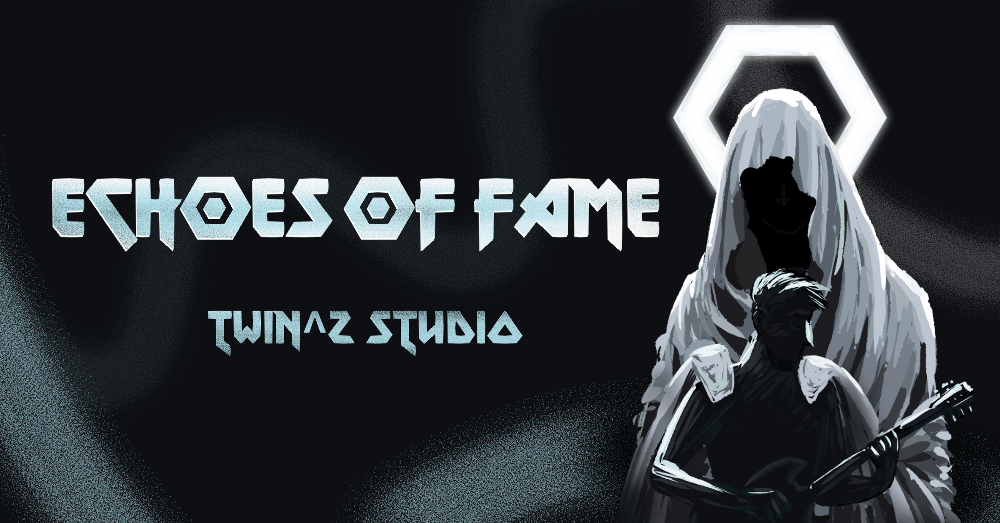

<h1 align="center"><b>Echoes Of Fame</b></h3>

  

## What is it?
Echoes Of Fame is a game developed along it's own game engine in 4 months, for courses conducted by the [Lodz University of Technology](https://p.lodz.pl/).

## Overview
Echoes of Fame is an area control strategy game in which we play the role of a music band wanting to conquer the world with their music. Apart from the player himself, there are opponents who have the same goal as us. This leads to a constant fight for influence between teams. However, we are not alone in these struggles. One of the ancient deities helps us in battle and protects us. Keep it up and don't let others drown out your music.

## How do I build and run this?
The project’s build and compilation process was tested in Visual Studio 2022 by opening the repository’s root folder in Visual Studio, selecting the desired build configuration, and then starting the build by clicking the green arrow.

## Engine
Our Engine is written in C++20; its architecture is based on **Object-Component model used by Unity**. We use **OpenGL** as our graphics API. Some notable systems:
- 3D physics engine (collision detection and ray intersection)
- Resource Managers (for sharing resources like models and textures)
- UI
- Input and Event systems
- Procedural Map generation system

## Editor
We developed our own editor along with countless tools and functionalities:

* Scene and prefab loading
* Debug logging
* Custom inspectors for specific Components
* Adding new objects and components
* Export objects to prefabs
* Save scenes

## Rendering
We are using forward rendering. We managed to implement a couple of rendering algorithms:
* Screen Space Ambient Occlusion (SSAO)
* Particles (and particle emitters, done on CPU)
* Multisample Anti-Aliasing (MSAA)
* Shadow mapping
* Volumetric clouds

## Thirdparty
Editor's UI is made with **[ImGui](https://github.com/ocornut/imgui)**. Audio is handled by **[soloud](https://github.com/jarikomppa/soloud)**. **[FreeType](https://github.com/freetype/freetype)** for fonts rendering. **[glm](https://github.com/g-truc/glm)** for additional math operations. (De)serializing yaml: **[yaml-cpp](https://github.com/jbeder/yaml-cpp)**. Window abstraction **[glfw](https://github.com/glfw/glfw)**. For logging **[spdlog](https://github.com/gabime/spdlog)**. To trace memory leaks and optimize engine and game **[tracey](https://github.com/wolfpld/tracy)**. Helper loading libraries used: **[stb_image](https://github.com/nothings/stb/blob/master/stb_image.h), [assimp](https://github.com/assimp/assimp)**.

## Additional info
Our game and its engine advanced to the finals of the [ZTGK 2024](https://gry.it.p.lodz.pl/main/index.php/pl/) competition in the Game Development category.

## Credits
| Name | Link | Role |
|------|--------|--------|
| Marceli Antosik | https://github.com/Muppetsg2 | Code Quality & Testing Lead |
| Patryk Antosik | https://github.com/MAIPA01 | AI & UI Programming Lead |
| Łukasz Gapiński | https://github.com/lgapinski18 | 3D Physics Lead |
| Mateusz Gapiński | https://github.com/mateusz-gapinski | Rendering Lead |
| Maja Ochmańska | https://github.com/Maikomi | Art Lead |
| Tanuki | 🐾 |  Voice Acting |
